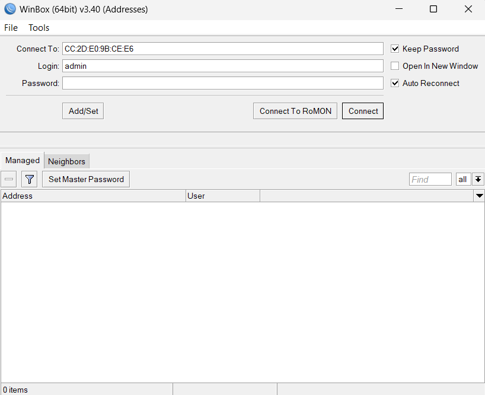
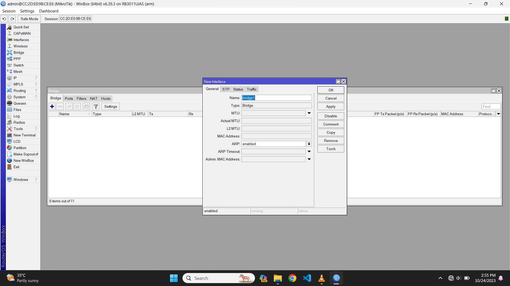
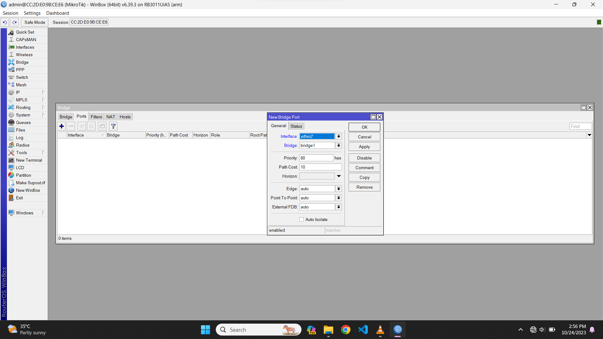
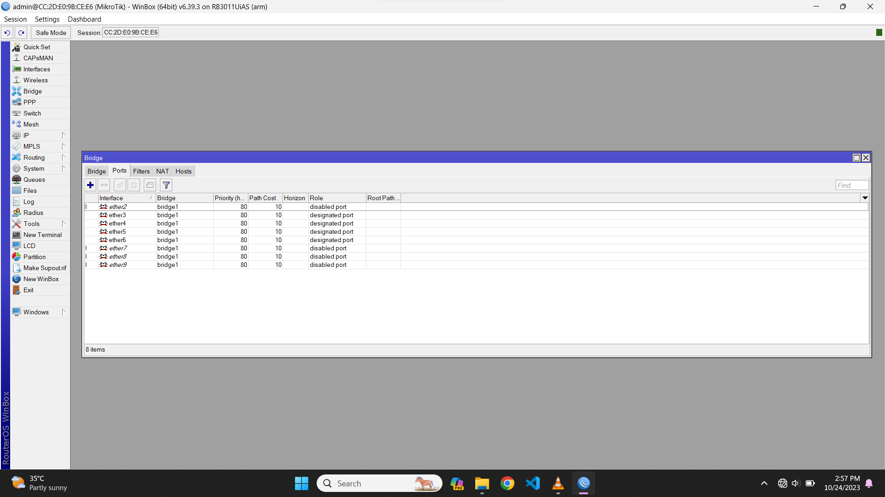
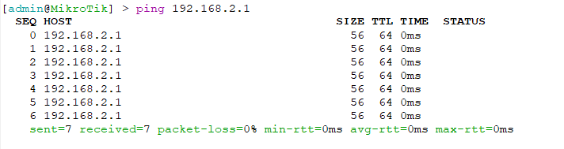
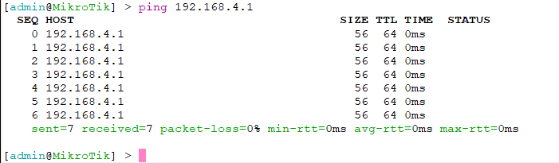
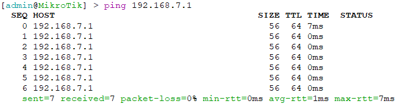

# Konfigurasi Mikrotik 🛰️

#

1. **Setup Bridge**: Menggabungkan beberapa interface menjadi satu jaringan logis.
2. **Tambahkan Interface pada Menu Ports**: Aktifkan koneksi ke jaringan dengan menambahkan interface 2-9 pada menu ports.
3. **Konfigurasi Address List**:
   - Bridge 1 diatur sebagai gateway.
   - Ether 1 diatur sebagai jaringan kelompok.
4. **Konfigurasi Route List**:
   - 192.168.10.0/24
   - 192.168.88.0/24
   - 0.0.0.0/0 dengan gateway .254 untuk mengarahkan lalu lintas ke luar jaringan.
5. **Konfigurasi DHCP Server**:
   - Server interface diatur ke bridge 1.
   - Address space: 192.168.88.0/24
   - Gateway: 192.168.88.10
   - Address range: 192.168.88.100 - 192.168.88.200
   - DNS server diatur ke 202.9.85.3
6. **Konfigurasi IP Firewall**:
   - Chain: srcnat
   - Source address: 192.168.10.0/24
   - Destination address: 0.0.0.0/0
   - Action: masquerade untuk menyembunyikan alamat IP sumber.

## Konfigurasi Lengkap

### 1. Masukkan MAC Address

    

### 2. Tampilan awal setelah login

    

### 3. Membuat Bridge baru

    

### 4. Tamabahkan ports yang dibutuhkan

    

 

    

### 5. Tamabahkan Address list

    

### 6. Tamabahkan routes yang dibutuhkan

    

### 5. Tes ping ke semua pc

    

    

    

    

    

    

    

    

    

    

